# UniConnect

![UniConnect Logo]

## 📋 Description du Projet

**UniConnect** est une plateforme web collaborative conçue pour les étudiants universitaires. Elle permet de faciliter la communication, le partage de ressources, l'organisation d'événements et le covoiturage entre étudiants.

### Fonctionnalités principales :
- **👥 Groupes d'étude** - Créer et rejoindre des groupes de travail collaboratifs
- **📅 Événements** - Organiser et participer à des hackathons, workshops et séminaires
- **📁 Portfolios** - Présenter ses projets et compétences aux recruteurs
- **💼 Offres** - Rejoindre des équipes de projet et collaborer avec d'autres étudiants
- **🤝 Covoiturage** - Partager des trajets et réduire les coûts de transport
- **📚 Ressources** - Accéder à des notes de cours, examens et matériels pédagogiques

---

## 👨‍💻 Membres du Groupe

| Membre | Rôle | Pages Développées |
|--------|------|-------------------|
| **Oussema Ben Elhaj** | Développeur | welcome_page, login, portfolios, details, offers, home |
| **Rayen Elfidha** | Développeur | liste-groupe, create-group, group-discussion, group-detail |
| **Ahmed Kalboussi** | Développeur | resources, add-resources, resources-category |
| **Yasmine Abedel Ali** | Développeur | AvisClient, ChercherCovoiturage, ListeTrajet, ProfileDeChauffeur |
| **Oussema Saidani** | Développeur | AddAi, AddMn, listeEvent, Paiement |

---

## 📸 Captures d'Écran

### 🏠 Pages Principales
| Interface | Capture |
|-----------|---------|
| Welcome Page | 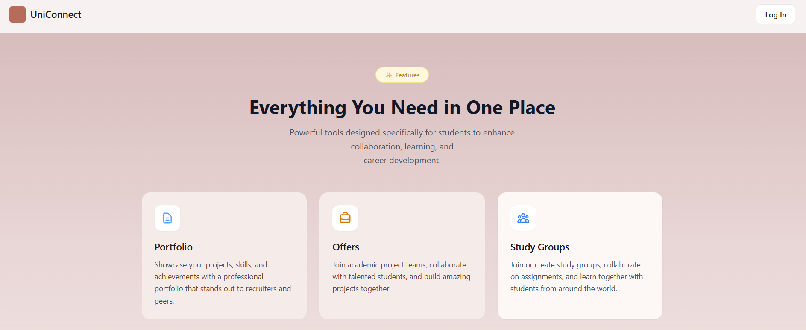 |
| Login | 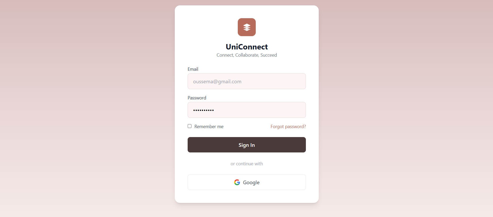 |
| Home | 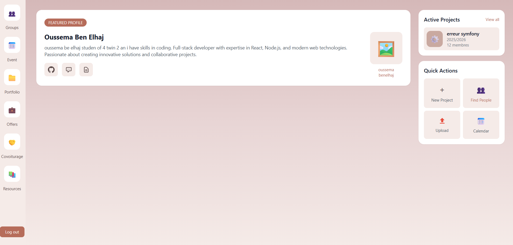 |

### 👥 Groupes d'Étude
| Interface | Capture |
|-----------|---------|
| Liste des Groupes | 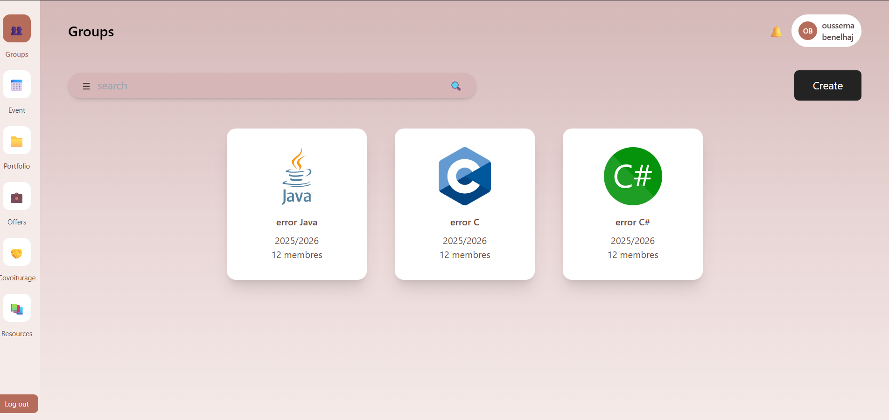 |
| Créer un Groupe | 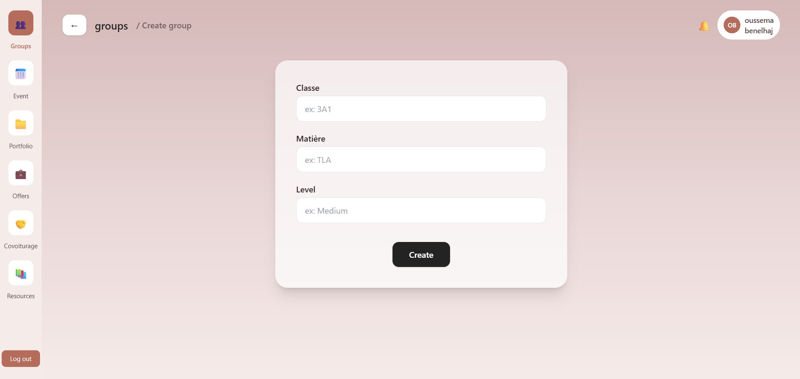 |
| Détail du Groupe | 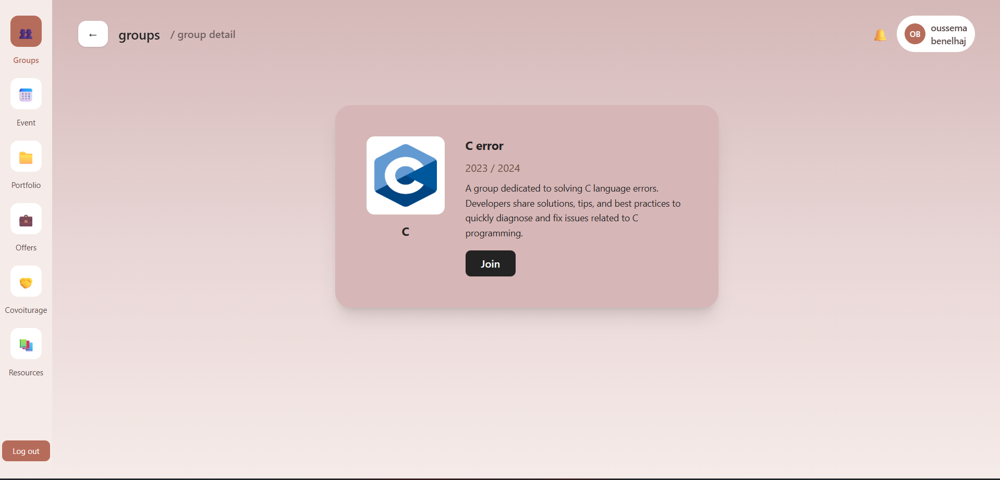 |
| Discussion de Groupe | 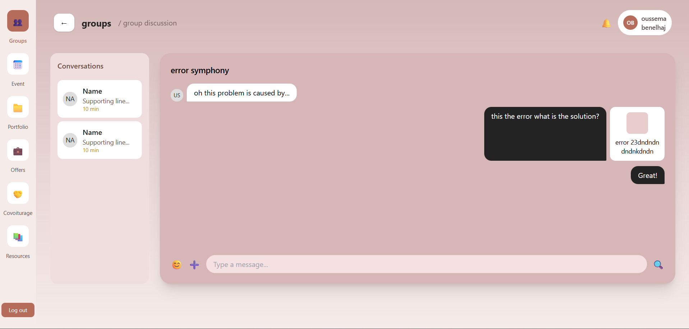 |

### 📅 Événements
| Interface | Capture |
|-----------|---------|
| Liste des Événements | 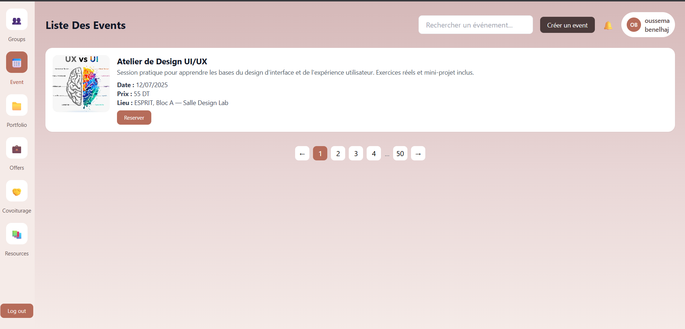 |
| Ajouter Événement (IA) | 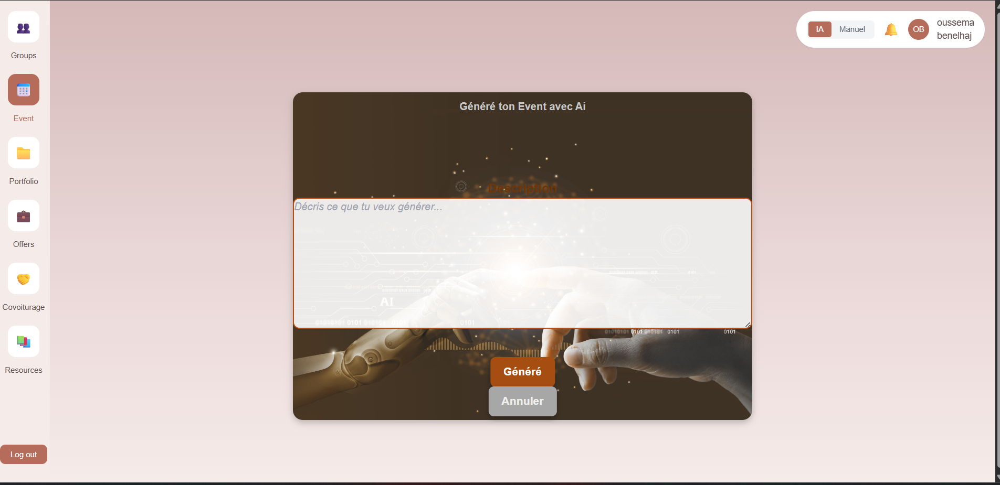 |
| Ajouter Événement (Manuel) | 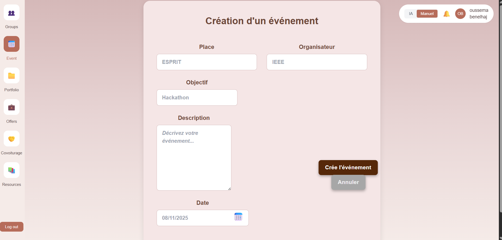 |
| Paiement | 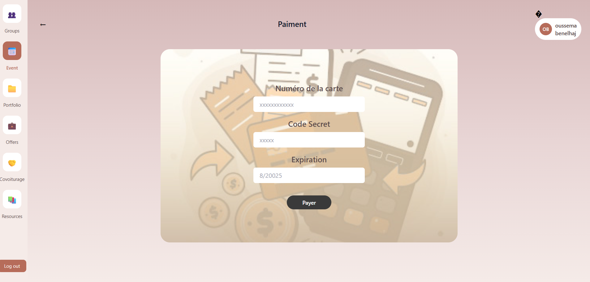 |

### 📁 Portfolios
| Interface | Capture |
|-----------|---------|
| Liste des Portfolios | 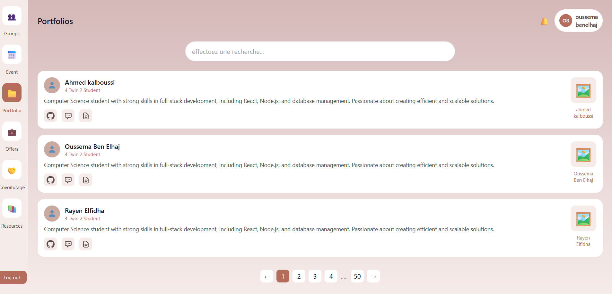 |
| Détails Portfolio | 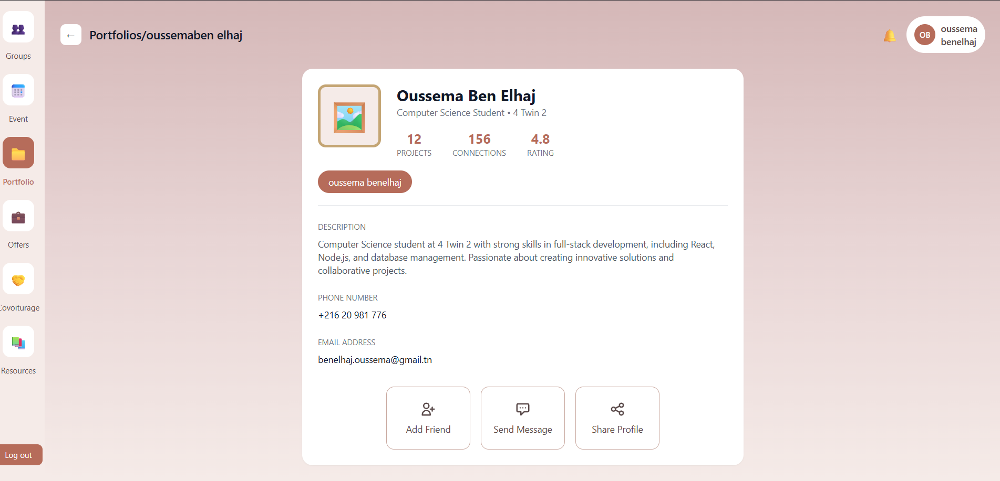 |

### 💼 Offres
| Interface | Capture |
|-----------|---------|
| Liste des Offres | 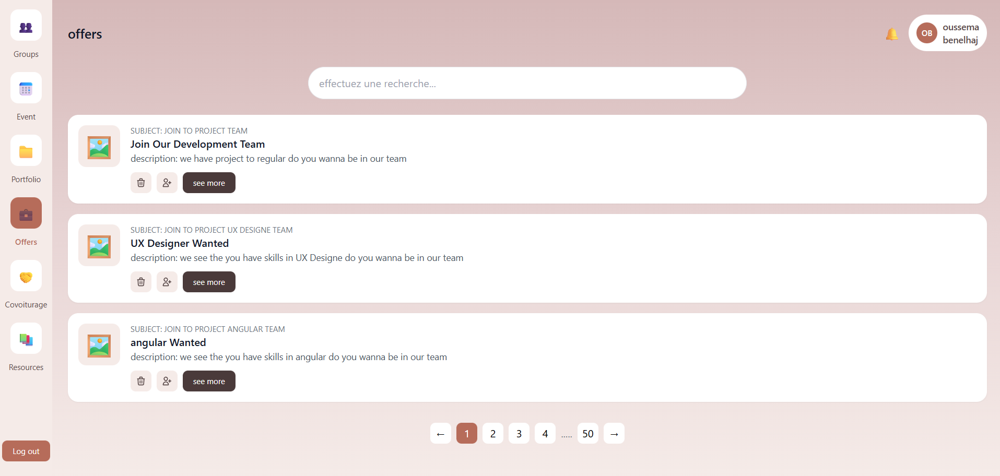 |

### 🤝 Covoiturage
| Interface | Capture |
|-----------|---------|
| Chercher Covoiturage | 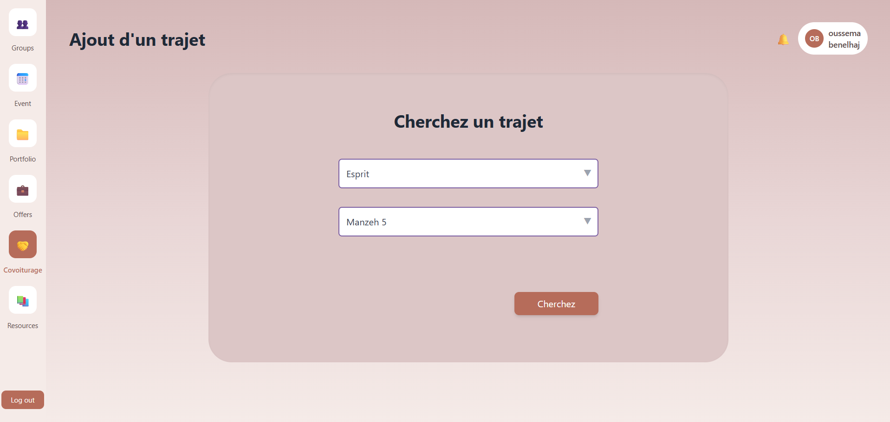 |
| Liste des Trajets | 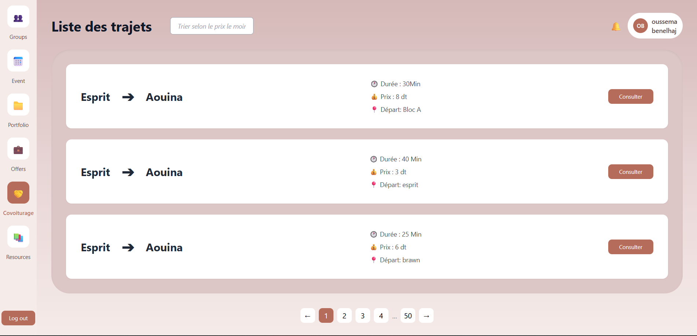 |
| Profil du Chauffeur | 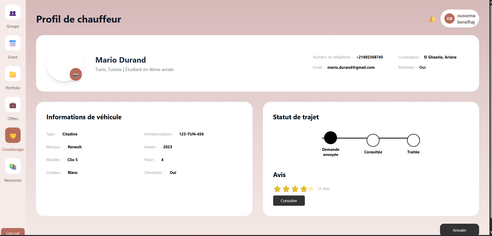 |
| Avis Clients | 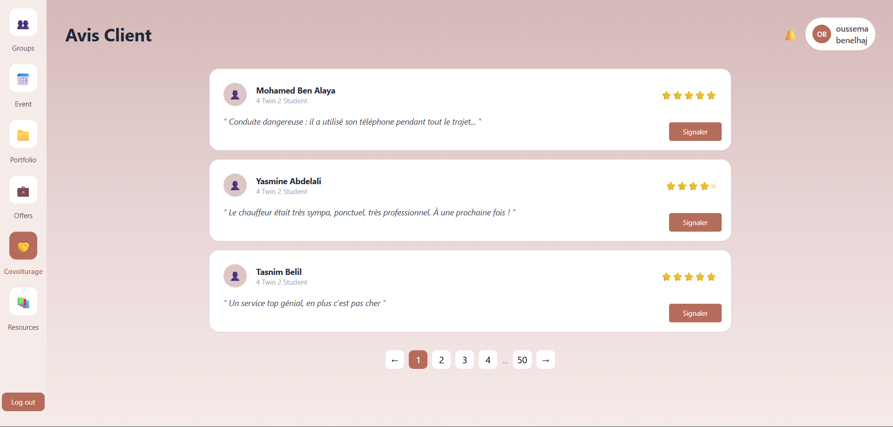 |

### 📚 Ressources
| Interface | Capture |
|-----------|---------|
| Liste des Ressources | 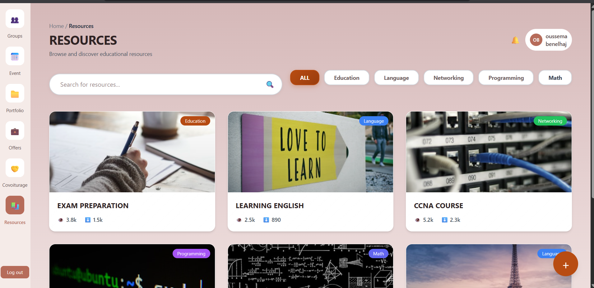 |
| Catégorie Ressources | 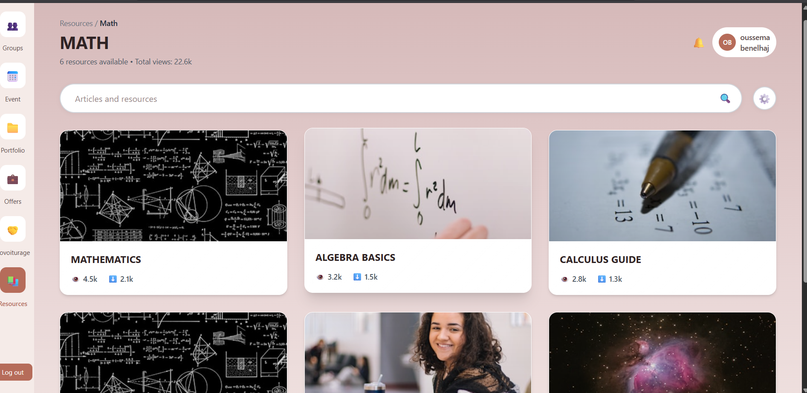 |
| Ajouter Ressource | 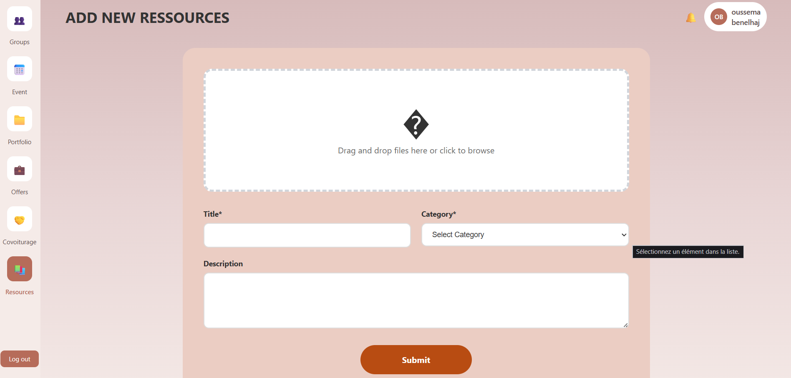 |

---

## 🛠️ Technologies Utilisées

### Front-End
| Technologie | Description |
|-------------|-------------|
| ![HTML5]| Structure des pages web |
| ![CSS3] | Styles personnalisés |
| ![Tailwind CSS] | Framework CSS utilitaire |
| ![SCSS] | Préprocesseur CSS |
| ![JavaScript] | Interactivité et logique côté client |

### Outils de Développement
| Outil | Description |
|-------|-------------|
| ![VS Code] | Éditeur de code |
| ![Git] | Gestion de versions |
| ![npm] | Gestionnaire de paquets |
| ![PostCSS] | Transformation CSS |

---

## 📁 Structure du Projet

```
UniConnect/
├── Event/
│   ├── css/                    # Fichiers CSS compilés
│   ├── scss/                   # Fichiers SCSS source
│   ├── images/                 # Images du projet
│   ├── icons/                  # Icônes
│   ├── welcome_page.html       # Page d'accueil
│   ├── login.html              # Page de connexion
│   ├── home.html               # Page principale
│   ├── listeEvent.html         # Liste des événements
│   ├── AddAi.html              # Création événement (IA)
│   ├── AddMn.html              # Création événement (Manuel)
│   ├── liste-groupe.html       # Liste des groupes
│   ├── create-group.html       # Création de groupe
│   ├── group-detail.html       # Détails du groupe
│   ├── group-discussion.html   # Discussion de groupe
│   ├── portfolios.html         # Liste des portfolios
│   ├── details.html            # Détails portfolio
│   ├── offers.html             # Offres
│   ├── ChercherCovoiturage.html# Recherche covoiturage
│   ├── ListeTrajet.html        # Liste des trajets
│   ├── ProfileDeChauffeur.html # Profil chauffeur
│   ├── AvisClient.html         # Avis clients
│   ├── resources.html          # Ressources
│   ├── resources-category.html # Catégorie ressources
│   ├── add-resources.html      # Ajout ressources
│   └── Paiement.html           # Page de paiement
├── EventScss/                  # Fichiers SCSS globaux
│   ├── main.scss
│   ├── main.css
│   └── _*.scss                 # Partials SCSS
├── screenshots/                # Captures d'écran
└── README.md                   # Ce fichier
```

---

## 🚀 Installation et Lancement

1. **Cloner le repository**
   ```bash
   git clone https://github.com/rayenelf/integration_Web.git
   cd uniconnect
   ```

2. **Installer les dépendances**
   ```bash
   cd Event
   npm install
   ```

3. **Compiler les fichiers SCSS** (optionnel)
   ```bash
   npm run build
   ```

4. **Ouvrir dans le navigateur**
   - Ouvrir `Event/welcome_page.html` dans votre navigateur

---

## 📄 Licence

Ce projet est réalisé dans le cadre d'un projet académique à ESPRIT.

© 2025 - UniConnect Team
